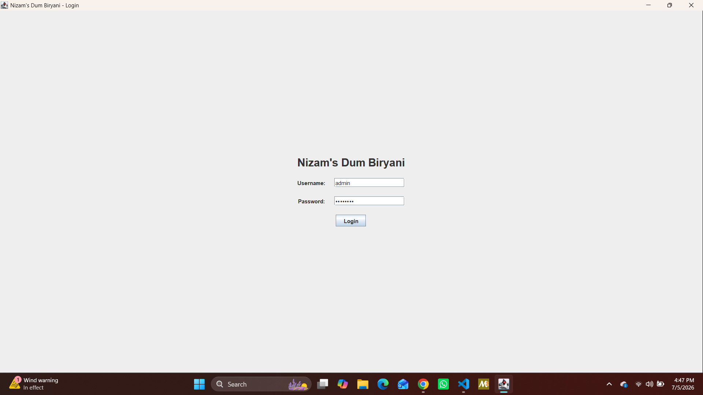
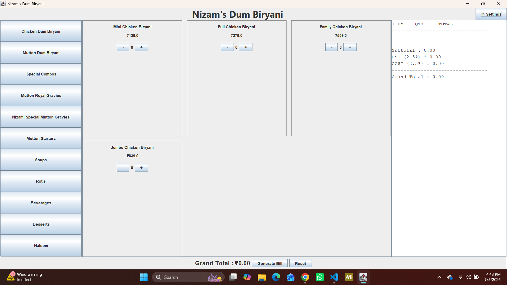
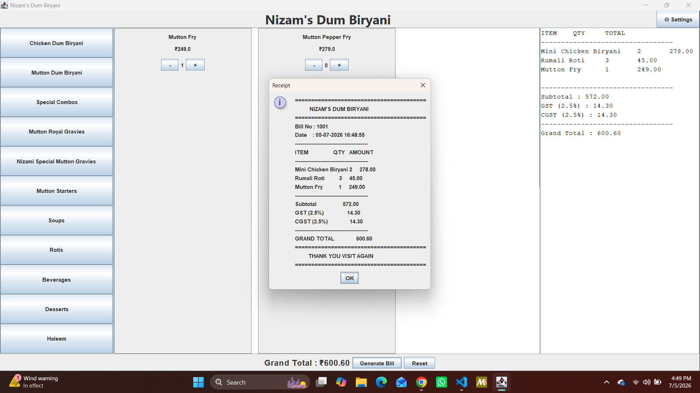

# 🍽️ Nizam's Dum Biryani - POS Billing System

A desktop-based **Point of Sale (POS) Billing System** developed in **Java** using **Java Swing**. This application is designed for restaurants to simplify billing, manage menu items, generate receipts, and calculate taxes automatically.

---

## ✨ Features

- 🔐 Login Authentication
- 📂 Category-wise Menu Navigation
- ➕ Add/Remove Items from Cart
- 🛒 Real-time Cart Management
- 🧾 Automatic Bill Generation
- 💰 GST & CGST Calculation
- 🖨️ Receipt Generation
- ⚙️ Settings Menu

---

## 🛠️ Technologies Used

- Java
- Java Swing
- AWT
- Object-Oriented Programming (OOP)

---

## 📸 Screenshots

### Login Screen



### Main Window



### Receipt



---

## 🚀 How to Run

1. Clone the repository:

```bash
git clone https://github.com/Wajahath-097/POS-Billing-System.git
```

2. Open the project in VS Code or any Java IDE.

3. Compile the Java files:

```bash
javac *.java
```

4. Run the application:

```bash
java PosBillingSystem
```

---

## 📁 Project Structure

```
POS-Billing-System/
│── screenshots/
│   ├── login.png
│   ├── main-window.png
│   └── receipt.png
│
├── Cart.java
├── CartItem.java
├── Category.java
├── LoginFrame.java
├── PosBillingSystem.java
├── Product.java
├── ReceiptGenerator.java
├── .gitignore
└── README.md
```

---

## 👨‍💻 Author

**Mohammed Wajahath Ullah Shareef**

GitHub: https://github.com/Wajahath-097

---

⭐ If you like this project, don't forget to star the repository!